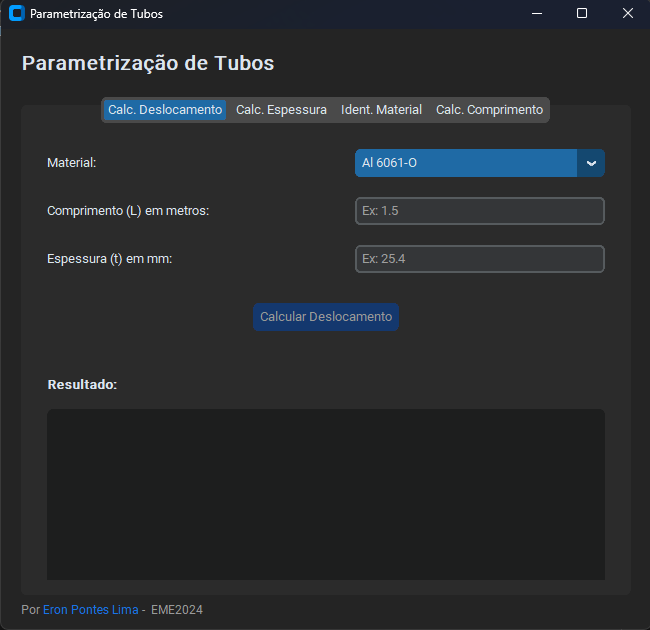

# Parametrização de tubos

O software Parametrização de Tubos foi desenvolvido para o cálculo de parâmetros dimensionais de tubos metálicos fabricados em aço e alumínio. Os valores determinados por este software servem como uma estimativa inicial para os parâmetros de entrada necessários durante simulações mecânicas realizadas para este tipo de peça.

